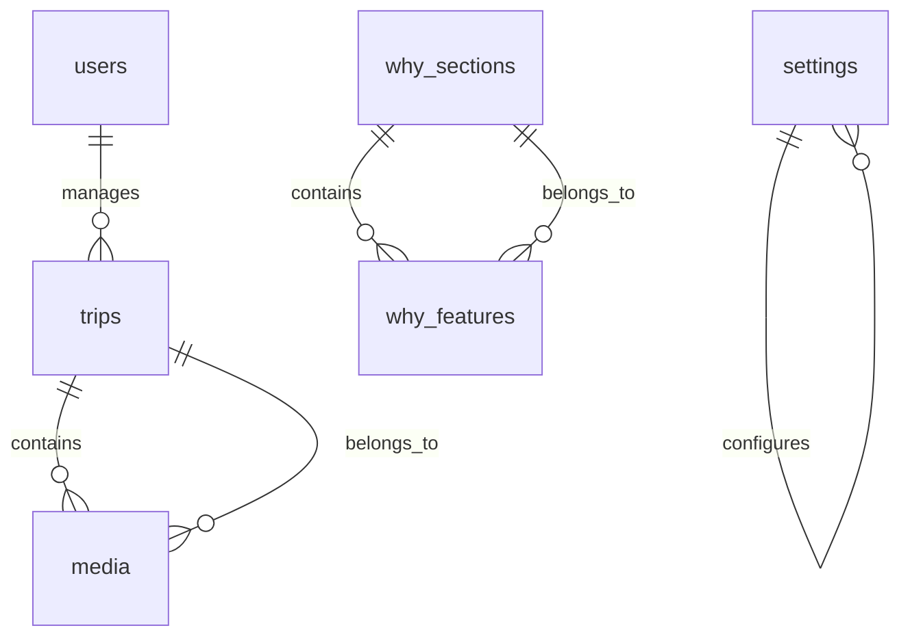

# 🗄️ Rihla Travels - Database Schema Documentation

## 📋 Overview

The Rihla Travels database schema is designed to support a comprehensive travel website with multilingual capabilities, content management, and specialized Islamic travel guidance features. The schema follows Laravel conventions and implements proper indexing for optimal performance.

## 🏗️ Database Architecture

### Engine & Version
- **Primary Database**: MySQL 8.0+ (Production)
- **Development**: SQLite (Local development)
- **Engine**: InnoDB (Transaction support)
- **Character Set**: UTF8MB4 (Full Unicode support)
- **Collation**: utf8mb4_unicode_ci

### Schema Design Principles
- **Normalization**: Properly normalized to reduce redundancy
- **Indexing**: Strategic indexes for query optimization
- **Relationships**: Foreign key constraints for data integrity
- **Multilingual**: Support for English and Dhivehi content
- **Soft Deletes**: Future-ready for soft deletion patterns

## 📊 Core Tables

### 1. Users Table
```sql
CREATE TABLE users (
    id BIGINT UNSIGNED AUTO_INCREMENT PRIMARY KEY,
    name VARCHAR(255) NOT NULL,
    email VARCHAR(255) UNIQUE NOT NULL,
    email_verified_at TIMESTAMP NULL,
    password VARCHAR(255) NOT NULL,
    is_admin BOOLEAN DEFAULT FALSE,
    remember_token VARCHAR(100) NULL,
    created_at TIMESTAMP NULL,
    updated_at TIMESTAMP NULL,
    
    INDEX idx_users_email (email),
    INDEX idx_users_admin (is_admin)
);
```

**Purpose**: User authentication and authorization  
**Key Features**:
- Standard Laravel authentication structure
- Admin role flag for content management access
- Email verification support

### 2. Trips Table
```sql
CREATE TABLE trips (
    id BIGINT UNSIGNED AUTO_INCREMENT PRIMARY KEY,
    -- Translated columns hold {"en": "...", "dv": "..."} and are read back in
    -- the request's locale, English first. See docs/adr/0001.
    title JSON NOT NULL,
    slug VARCHAR(255) UNIQUE NOT NULL,
    date_start DATE NOT NULL,
    date_end DATE NOT NULL,
    location JSON NULL,
    summary JSON NULL,
    details JSON NULL,
    price_from_mvr INT UNSIGNED NULL,
    status ENUM('current', 'upcoming', 'past') DEFAULT 'upcoming',
    cover_image VARCHAR(255) NULL,
    is_published BOOLEAN DEFAULT TRUE,
    created_at TIMESTAMP NULL,
    updated_at TIMESTAMP NULL,

    INDEX idx_trips_slug (slug),
    INDEX idx_trips_status (status),
    INDEX idx_trips_published (is_published),
    INDEX idx_trips_dates (date_start, date_end)
);
```

**Purpose**: Travel package information and management  
**Key Features**:
- Multilingual content (English/Dhivehi)
- SEO-friendly slugs
- Date-based trip categorization
- Pricing information
- Publication status control

### 3. Media Table
```sql
CREATE TABLE media (
    id BIGINT UNSIGNED AUTO_INCREMENT PRIMARY KEY,
    trip_id BIGINT UNSIGNED NULL,
    type ENUM('photo', 'video') NOT NULL,
    title VARCHAR(255) NULL,
    caption TEXT NULL,
    file_path VARCHAR(255) NULL,
    video_url VARCHAR(500) NULL,
    thumb_path VARCHAR(255) NULL,
    sort_order SMALLINT DEFAULT 0,
    is_published BOOLEAN DEFAULT TRUE,
    created_at TIMESTAMP NULL,
    updated_at TIMESTAMP NULL,
    
    FOREIGN KEY (trip_id) REFERENCES trips(id) ON DELETE CASCADE,
    INDEX idx_media_trip (trip_id),
    INDEX idx_media_type (type),
    INDEX idx_media_published (is_published),
    INDEX idx_media_order (sort_order)
);
```

**Purpose**: Media asset management (photos and videos)  
**Key Features**:
- Support for both photos and videos
- YouTube URL integration for video content
- Sortable media ordering
- Trip association with cascade delete

### 4. Settings Table
```sql
CREATE TABLE settings (
    id BIGINT UNSIGNED AUTO_INCREMENT PRIMARY KEY,
    key VARCHAR(255) UNIQUE NOT NULL,
    value JSON NOT NULL,
    created_at TIMESTAMP NULL,
    updated_at TIMESTAMP NULL,
    
    INDEX idx_settings_key (key)
);
```

**Purpose**: Application configuration and social media settings  
**Key Features**:
- JSON storage for flexible configuration
- Social media integration settings
- WhatsApp configuration
- YouTube playlist management

## 📖 Guide & Content Tables

### 5. Guide Steps Table
```sql
CREATE TABLE guide_steps (
    id BIGINT UNSIGNED AUTO_INCREMENT PRIMARY KEY,
    step_number TINYINT NOT NULL,
    -- Translated columns hold {"en": ..., "dv": ...}; the list columns hold
    -- {"en": [...], "dv": [...]}. See docs/adr/0001.
    title JSON NOT NULL,
    summary JSON NULL,
    details JSON NULL,
    reference_text JSON NULL,
    fiqh_notes JSON NULL,
    checklist JSON NULL,
    -- Not translated: the Arabic of the rite, the same in every language.
    dua_text TEXT NULL,
    video_url VARCHAR(500) NULL,
    image_path VARCHAR(255) NULL,
    is_published BOOLEAN DEFAULT TRUE,
    created_at TIMESTAMP NULL,
    updated_at TIMESTAMP NULL,

    INDEX idx_guide_steps_number (step_number),
    INDEX idx_guide_steps_published (is_published, step_number)
);
```

**Purpose**: Islamic travel guidance (Umrah/Hajj steps)  
**Key Features**:
- Step-by-step pilgrimage guidance
- Multilingual support
- Dua text for each step
- Fiqh notes (JSON for different schools of thought)
- Checklist functionality
- Video and image support

### 6. Hero Banners Table
```sql
CREATE TABLE hero_banners (
    id BIGINT UNSIGNED AUTO_INCREMENT PRIMARY KEY,
    locale ENUM('en', 'dv') NOT NULL,
    title VARCHAR(120) NOT NULL,
    subtitle VARCHAR(200) NULL,
    primary_cta_text VARCHAR(60) NULL,
    primary_cta_url VARCHAR(255) NULL,
    secondary_cta_text VARCHAR(60) NULL,
    secondary_cta_url VARCHAR(255) NULL,
    image_path VARCHAR(255) NULL,
    overlay_opacity TINYINT UNSIGNED DEFAULT 40,
    sort_order INT DEFAULT 0,
    is_active BOOLEAN DEFAULT TRUE,
    start_at TIMESTAMP NULL,
    end_at TIMESTAMP NULL,
    created_at TIMESTAMP NULL,
    updated_at TIMESTAMP NULL,
    
    INDEX idx_hero_banners_locale (locale),
    INDEX idx_hero_banners_active (is_active),
    INDEX idx_hero_banners_locale_active (locale, is_active),
    INDEX idx_hero_banners_order (locale, is_active, sort_order),
    INDEX idx_hero_banners_dates (locale, is_active, start_at, end_at)
);
```

**Purpose**: Homepage banner management  
**Key Features**:
- Multilingual banner content
- Call-to-action button management
- Scheduled banner display (start/end dates)
- Sortable banner ordering
- Overlay customization

### 7. Why Sections Table
```sql
CREATE TABLE why_sections (
    id BIGINT UNSIGNED AUTO_INCREMENT PRIMARY KEY,
    locale VARCHAR(2) DEFAULT 'en',
    title VARCHAR(255) NOT NULL,
    subtitle TEXT NULL,
    image_path VARCHAR(255) NULL,
    primary_cta_text VARCHAR(60) NULL,
    primary_cta_url VARCHAR(255) NULL,
    secondary_cta_text VARCHAR(60) NULL,
    secondary_cta_url VARCHAR(255) NULL,
    background_color VARCHAR(7) NULL,
    text_color VARCHAR(7) NULL,
    button_color VARCHAR(7) NULL,
    is_active BOOLEAN DEFAULT TRUE,
    created_at TIMESTAMP NULL,
    updated_at TIMESTAMP NULL,
    
    INDEX idx_why_sections_locale (locale),
    INDEX idx_why_sections_active (is_active)
);
```

**Purpose**: Feature highlight sections on homepage  
**Key Features**:
- Multilingual content support
- Custom color styling
- Call-to-action management
- Visual customization options

### 8. Why Features Table
```sql
CREATE TABLE why_features (
    id BIGINT UNSIGNED AUTO_INCREMENT PRIMARY KEY,
    why_section_id BIGINT UNSIGNED NOT NULL,
    icon VARCHAR(255) NULL,
    title VARCHAR(255) NOT NULL,
    text TEXT NULL,
    image_path VARCHAR(255) NULL,
    link_url VARCHAR(255) NULL,
    link_text VARCHAR(60) NULL,
    background_color VARCHAR(7) NULL,
    sort_order INT UNSIGNED DEFAULT 0,
    is_active BOOLEAN DEFAULT TRUE,
    created_at TIMESTAMP NULL,
    updated_at TIMESTAMP NULL,
    
    FOREIGN KEY (why_section_id) REFERENCES why_sections(id) ON DELETE CASCADE,
    INDEX idx_why_features_section (why_section_id),
    INDEX idx_why_features_active (is_active),
    INDEX idx_why_features_order (sort_order)
);
```

**Purpose**: Individual features within why sections  
**Key Features**:
- Section association with cascade delete
- Icon and image support
- Link functionality
- Custom styling options
- Sortable ordering

## 🔗 Table Relationships

### Primary Relationships



### Relationship Details

1. **Users ↔ Trips**
   - One-to-Many (implicit)
   - Users can manage multiple trips through admin interface

2. **Trips ↔ Media**
   - One-to-Many
   - `trip_id` foreign key with CASCADE DELETE
   - Trip deletion removes all associated media

3. **Why Sections ↔ Why Features**
   - One-to-Many
   - `why_section_id` foreign key with CASCADE DELETE
   - Section deletion removes all associated features

## 📈 Indexing Strategy

### Primary Indexes
```sql
-- Users table
INDEX idx_users_email (email)
INDEX idx_users_admin (is_admin)

-- Trips table
INDEX idx_trips_slug (slug)
INDEX idx_trips_status (status)
INDEX idx_trips_published (is_published)
INDEX idx_trips_dates (date_start, date_end)
INDEX idx_trips_locale (locale)

-- Media table
INDEX idx_media_trip (trip_id)
INDEX idx_media_type (type)
INDEX idx_media_published (is_published)
INDEX idx_media_order (sort_order)

-- Guide steps table
INDEX idx_guide_steps_number (step_number)

-- Hero banners table
INDEX idx_hero_banners_locale_active (locale, is_active)
INDEX idx_hero_banners_order (locale, is_active, sort_order)
INDEX idx_hero_banners_dates (locale, is_active, start_at, end_at)
```

### Composite Indexes
- **Performance Optimization**: Multi-column indexes for common query patterns
- **Locale-based Queries**: Combined indexes with locale for multilingual content
- **Publication Status**: Combined indexes with is_published for content filtering
- **Sorting**: Combined indexes with sort_order for ordered content retrieval

## 🌐 Multilingual Support

### Locale Implementation
- **Supported Locales**: `en` (English), `dv` (Dhivehi)
- **Default Locale**: English (`en`)
- **RTL Support**: Database ready for right-to-left language display
- **Content Strategy**: JSON translatable columns, per
  [ADR 0001](adr/0001-how-content-is-translated.md). The tables below that
  still use a `locale` column with one row per language are converted next.

### Multilingual Tables
1. **Trips**: `title`, `location`, `summary`, `details` — one row, JSON per
   language, English fallback (`spatie/laravel-translatable`)
2. **Guide Steps**: `title`, `summary`, `details`, `reference_text`,
   `fiqh_notes`, `checklist` — one row, JSON per language. `dua_text` is not
   translated
3. **Hero Banners**: `locale` enum, one row per language — *to convert*
4. **Why Sections**: `locale` field, one row per language — *to convert*
5. **Why Features**, **Media**: no translation mechanism at all — *to add*

## 🔒 Data Integrity & Constraints

### Foreign Key Constraints
```sql
-- Media references trips
FOREIGN KEY (trip_id) REFERENCES trips(id) ON DELETE CASCADE

-- Why features reference sections
FOREIGN KEY (why_section_id) REFERENCES why_sections(id) ON DELETE CASCADE
```

### Unique Constraints
```sql
-- Users email uniqueness
UNIQUE KEY unique_users_email (email)

-- Trip slug uniqueness
UNIQUE KEY unique_trips_slug (slug)

-- Settings key uniqueness
UNIQUE KEY unique_settings_key (key)
```

### Check Constraints
- **Status Enum**: Trips limited to 'current', 'upcoming', 'past'
- **Media Type Enum**: Media limited to 'photo', 'video'
- **Locale Values**: Proper locale validation in enum fields

## 📊 Data Types & Storage

### String Types
- **VARCHAR**: Variable-length strings with appropriate limits
- **TEXT**: Medium-length text content
- **LONGTEXT**: Long-form content (trip details)

### Numeric Types
- **BIGINT UNSIGNED**: Primary keys and foreign keys
- **TINYINT**: Small integers (step numbers, overlay opacity)
- **INT UNSIGNED**: Medium integers (prices, sort orders)
- **SMALLINT**: Small integers (sort order for media)

### Special Types
- **JSON**: Flexible configuration storage (settings, checklists, fiqh notes)
- **ENUM**: Controlled value sets (status, type, locale)
- **BOOLEAN**: True/false flags (publication status, admin role)
- **DATE/TIMESTAMP**: Temporal data with appropriate precision

## 🚀 Performance Considerations

### Query Optimization
- **Index Strategy**: Strategic indexing for common query patterns
- **ForeignKey Integrity**: Proper foreign key relationships for data consistency
- **Composite Indexes**: Multi-column indexes for complex queries

### Storage Optimization
- **Appropriate Data Types**: Efficient storage with proper type selection
- **Text Storage**: TEXT vs LONGTEXT based on content length needs
- **Null Handling**: Proper NULL constraints for optional fields

### Scalability Features
- **Normalized Design**: Proper normalization to reduce redundancy
- **Efficient Relationships**: One-to-many relationships for scalability
- **Locale Support**: Flexible multilingual content architecture

## 🔧 Migration Strategy

### Laravel Migrations
All database changes are tracked through Laravel migrations:
- **Version Control**: Database schema versioned with application code
- **Rollback Support**: Each migration includes down() method for rollbacks
- **Team Collaboration**: Shared database schema through migration files

### Migration Files
1. `0001_01_01_000000_create_users_table.php` - Basic user authentication
2. `2025_08_26_172420_create_trips_table.php` - Core trip management
3. `2025_08_26_172420_create_media_table.php` - Media asset management
4. `2025_08_26_172421_create_settings_table.php` - Application settings
5. `2025_08_26_194801_create_guide_steps_table.php` - Islamic travel guide
6. `2025_08_28_164745_create_hero_banners_table.php` - Homepage banners
7. `2025_08_29_000001_create_why_sections_table.php` - Feature sections
8. `2025_08_29_000002_create_why_features_table.php` - Feature items

### Schema Extensions
- **Locale Support**: Added to trips and guide steps tables
- **Enhanced Guide**: Extended guide steps with dua, fiqh, and checklist fields
- **Custom Styling**: Added color fields to sections and features

## 🛠️ Database Management

### Backup Strategy
```bash
# Database backup
mysqldump -u username -p database_name > backup_$(date +%Y%m%d_%H%M%S).sql

# Laravel backup (if using spatie/laravel-backup)
php artisan backup:run
```

### Maintenance Tasks
```bash
# Laravel commands
php artisan migrate
php artisan db:seed
php artisan migrate:status
php artisan schema:dump
```

### Performance Monitoring
- **Query Logging**: Enable Laravel query logging for optimization
- **Index Analysis**: Regular index usage analysis
- **Storage Optimization**: Periodic database optimization

---

**Document Version**: 1.0  
**Last Updated**: December 2024  
**Database Version**: MySQL 8.0+  
**Laravel Version**: 11.x
