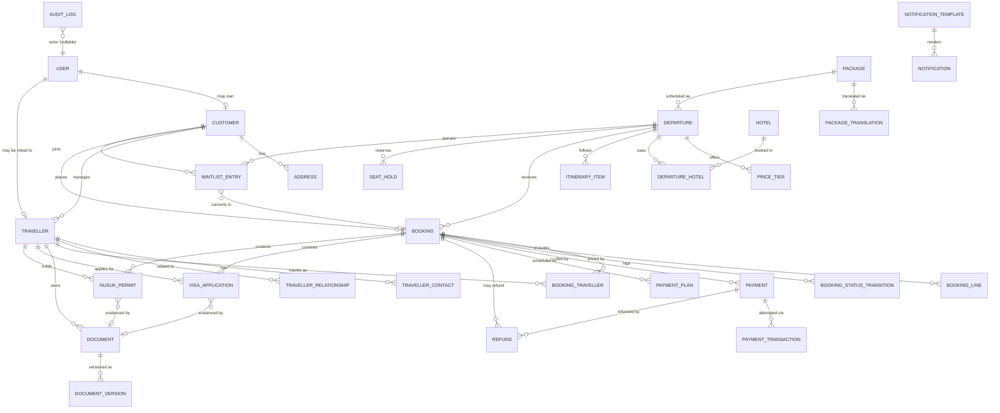

# Rihla Platform — Domain Model & Booking Engine

**Version:** 1.1
**Date:** 2026-09-17
**Status:** Design specification — **no code, no migrations, nothing executed**
**Applies to:** `ampilarey/rihla` @ `8880b0f`
**Companion document:** [`WEBSITE_UPGRADE_PLAN.md`](WEBSITE_UPGRADE_PLAN.md) v1.1 (§31 maps this document against it)

*v1.1: sections renumbered to the 30-part structure the brief asked for (Package vs Departure and Booking Aggregate are now separate sections, as are Identity & Permissions and Security & Privacy); all cross-references repaired; `WaitlistEntry` added — the master plan promised a waiting list with auto-promotion and v1.0 had no entity for it.*

> **Rule for this document: document first, code second.** Nothing here has been implemented. No migration has been written or run. No existing behaviour has been changed. Where a decision could reasonably go either way, it is recorded in §28 (Open Decisions) rather than settled silently.

---

## 1. Executive Summary

Rihla today is a brochure site with a six-table content model. The booking engine, payments, documents, visas and permits described in the master plan have no domain foundation to sit on. This document designs that foundation.

**The five decisions that matter most:**

1. **`Trip` is not sufficient and must not simply be renamed.** It conflates a commercial product with a scheduled instance of that product, and it carries display concerns (`cover_image`, `is_published`, `status: current|upcoming|past`) that belong to the website, not the business. It becomes **`Package` + `Departure`**, with `trips` preserved read-only through the transition (§25).
2. **Customer and Traveller are separate entities**, and a traveller does **not** require a user account. One customer manages many travellers; one traveller appears in many bookings across years. Passport identity — not email — is the traveller's natural key (§5).
3. **`Booking` is the aggregate root** for a party's purchase; capacity is owned by `Departure` and protected with **pessimistic row locking plus a database-level invariant**, because the "last seat sold twice" race is the one bug that costs real money and real trust (§9, §22).
4. **Payments, documents, visas and Nusuk permits are separate aggregates**, deliberately not fields on `Booking`. Each has its own lifecycle, its own actors, and its own audit trail. A booking can be fully paid while a traveller's visa is rejected; the model must express that without contradiction (§11–§14).
5. **This stays a modular monolith.** New domain code lands under `app/Domains/`, Laravel events are used where they earn their place, and the event bus, lakehouse, multi-tenancy and marketplace architecture from the source material stay deferred (§29).

**What must exist before any booking UI is written:** the `packages`/`departures`/`bookings`/`booking_travellers` tables, the booking state machine, capacity locking, the payment intent/transaction split with idempotent callbacks, audit logging, and the role/permission model. Everything else can follow (§30).

---

## 2. Current Architecture Findings

### 2.1 Verified stack

| Item | Finding |
|---|---|
| Framework | Laravel 13 (`laravel/framework ^13.0`) |
| PHP | `^8.3` (Laravel 13 floor; production must run 8.3+) |
| Frontend | **Blade + Alpine.js 3 + Tailwind, built with Vite 7.** There is **no React, no Inertia, no Livewire.** |
| Bootstrap | `bootstrap/app.php` — web + api + console routes, health at `/up`, one appended middleware (`SetLocale`) |
| Providers | `AppServiceProvider`, `AuthServiceProvider`, `ViewServiceProvider` |
| Authorization | Two gates, both identical: `admin` and `manage-content`, each returning `$user->is_admin === true`. **Zero policies.** |
| Domain layer | **None.** No `app/Policies`, `app/Events`, `app/Jobs`, `app/Listeners`, `app/Observers`. `app/Services/` contains only `Deploy/TestDeployTrigger`. |
| Models (8) | `Trip`, `Media`, `Setting`, `GuideStep`, `HeroBanner`, `WhySection`, `WhyFeature`, `User` |
| Migrations | 19 |
| Queues / events | Nothing queued, nothing dispatched. `QUEUE_CONNECTION` defaults to `database`; tests run `sync`. |
| Payments | **No payment code of any kind.** |
| API | `routes/api.php` has exactly two routes: `GET /health` and the `POST /deploy/test-pull` webhook. No resources, no versioning, no auth. |
| Tests | 12 files, mostly Breeze defaults; `phpunit.xml` uses in-memory SQLite |
| Tooling | Pint (`composer lint:php`), Larastan (`composer analyse`); **no CI runs either** |
| Deployment | cPanel shared hosting; GitHub Actions webhook → `scripts/pull-deploy-test.sh`; `public/build` committed because there is no Node on the server |

### 2.2 The existing `Trip` model, examined

```php
// app/Models/Trip.php — abridged
protected $fillable = [
  'locale','title','title_dv','slug','date_start','date_end',
  'location','location_dv','summary','summary_dv','details','details_dv',
  'price_from_mvr','status','cover_image','is_published',
];
const STATUSES = ['current','upcoming','past'];
public function media(): HasMany   // hasMany(Media::class)
```

Five structural problems, each of which the target model resolves:

| # | Problem | Consequence |
|---|---|---|
| T1 | **Product and schedule are the same row.** A trip *is* its dates. | Running the same Ramadan package three times means three duplicated content rows. Editing the itinerary means editing it N times. |
| T2 | **`status: current\|upcoming\|past` is derived display state, not lifecycle.** It is a function of `date_start`/`date_end`. | It will silently drift from reality, and it cannot express the states that matter commercially: `draft`, `selling`, `sold_out`, `closed`, `cancelled`, `departed`. |
| T3 | **`price_from_mvr` is a single nullable integer.** | Cannot express adult/child, room occupancy, deposits, extras, or currency. It is a marketing label, not a price. |
| T4 | **Translations are `*_dv` columns plus a `locale` column.** The two mechanisms contradict each other — is a row a language, or does a row contain languages? | Adding Arabic means five more columns on every content table. Per-locale slugs and per-locale SEO are impossible. |
| T5 | **`media` is `hasMany` on `trips` directly** (`media.trip_id`). | Media cannot attach to a package, a hotel, a Ziyarah location or an article without more foreign keys. |

### 2.3 Identity, access and locale as they stand

- `User` has `name`, `email`, `password`, `is_admin`. There is no customer profile, no phone, no address, no locale preference, no relationship to anything.
- Authorization is one boolean. Nine distinct staff functions are described in the master plan; a boolean expresses one.
- **`SetLocale` reads the locale from the session only** — `session('app_locale', 'en')`, switched via `GET /lang/{locale}`. There are **no per-locale URLs**.

> **This last point is a conflict with the master plan, not merely a gap.** `WEBSITE_UPGRADE_PLAN.md` §3 P0.5 calls for `hreflang` alternates and a two-locale sitemap. Both are meaningless while `/trips/hajj-2026` serves English or Dhivehi depending on a session cookie: there is no distinct URL for a crawler to index, `hreflang` has nothing to point at, and the canonical tag already emitted (`url()->current()`) is the same for both languages. **Locale must move into the URL** (`/en/...`, `/dv/...`, or a locale-prefixed route group) before the SEO work in the master plan can do anything. See §19 and §28 D-7.

### 2.4 What can be kept

Not everything needs replacing. `Setting`, `GuideStep`, `HeroBanner`, `WhySection`, `WhyFeature` are CMS furniture and are fine where they are. `User` is extended, not replaced. `Media` is generalised to a polymorphic attachment. Only `Trip` is genuinely superseded.

---

## 3. Target Domain Model

### 3.1 Bounded contexts

| Context | Owns | Core entities |
|---|---|---|
| **Identity** | Who can sign in and what they may do | `User`, `Role`, `Permission` |
| **Customer** | The commercial relationship | `Customer`, `Address`, `TravellerContact` |
| **Traveller** | The person who travels | `Traveller`, `TravellerRelationship` |
| **Catalog** | What Rihla sells | `Package`, `PackageTranslation`, `Departure`, `PriceTier`, `Hotel`, `ItineraryItem` |
| **Booking** | The purchase and its lifecycle | `Booking`, `BookingTraveller`, `BookingLine`, `SeatHold`, `WaitlistEntry`, `BookingStatusTransition` |
| **Payment** | Money in and out | `Payment`, `PaymentTransaction`, `Refund` |
| **Documents** | Evidence about people | `Document`, `DocumentVersion` |
| **Visa** | Saudi entry authorisation | `VisaApplication` |
| **Permits** | Nusuk permits and slots | `NusukPermit` |
| **Notifications** | Talking to people | `Notification`, `NotificationTemplate` |
| **Audit** | What happened and who did it | `AuditLog` |

### 3.2 Entities deliberately **not** created

The prompt's candidate list included entities that do not earn their place yet. Recording the rejections is part of the design:

| Candidate | Verdict | Reason |
|---|---|---|
| `DocumentVersion` | **Kept** | Passport replacement must not destroy history (§12) |
| `PaymentTransaction` | **Kept** | Gateway attempts are many-to-one against a payment intent (§11) |
| `Address` | **Kept, minimal** | One address per customer for invoicing; not a generic address book |
| `TravellerContact` | **Kept** | Emergency contact is an operational and safety requirement, and is not the same as the customer |
| `NotificationTemplate` | **Kept** | Multilingual templates are a hard requirement (§15) |
| `Customer` | **Kept but thin** | A profile hanging off `User`, not a parallel identity system (§5.2) |
| `BookingLine` | **Kept** | Needed to express extras/discounts/fees as line items rather than opaque totals (§10) |
| `PackageTranslation` | **Kept** | Per-locale slug + SEO cannot be done in JSON columns cleanly on MySQL (§19) |
| `DepartureTranslation` | **Rejected** | A departure has dates and capacity, not prose. Any per-departure copy belongs to its package. |
| `BookingTranslation` | **Rejected** | A booking is a record, not content. Its documents render in the customer's locale at generation time. |
| `TravellerTranslation` | **Rejected** | Names are transliterated once into `name_latin` / `name_dhivehi` fields; that is data, not translation |
| Generic `Party`/`Contact` supertype | **Rejected** | Premature abstraction; two concrete entities are clearer than one polymorphic one |

---

## 4. Entity Definitions

Field lists are indicative, not final migrations. `*` marks a translatable field (§19). Every table carries `created_at`/`updated_at`; those that participate in audit also carry `created_by`/`updated_by`.

### Identity

**`users`** *(extend the existing table — do not replace)*
`id`, `name`, `email`, `password`, `phone`, `locale`, `timezone`, `last_login_at`, `is_active`, `email_verified_at`
*Removed after migration:* `is_admin` (superseded by roles — see §17 and §25.4)

**`roles` / `permissions` / pivots** — from `spatie/laravel-permission` (§17).

### Customer

**`customers`**
`id`, `ulid`, `reference` (`RIH-C-000123`), `user_id` (nullable — walk-in customers exist before accounts do), `type` (`individual|family|corporate|agent`), `display_name`, `email`, `phone`, `whatsapp`, `preferred_locale`, `preferred_channel`, `national_id`, `notes`, `status`, `marketing_opt_in_at`

**`addresses`**
`id`, `customer_id`, `label`, `line1`, `line2`, `island`, `atoll`, `country`, `postcode`, `is_default`

### Traveller

**`travellers`**
`id`, `ulid`, `reference` (`RIH-T-000123`), `customer_id` (the managing customer), `user_id` (**nullable** — portal access is optional), `name_latin`, `name_dhivehi`, `name_arabic`, `gender`, `date_of_birth`, `nationality`, `national_id`, **`passport_number` (encrypted)**, `passport_issue_date`, `passport_expiry_date`, `passport_country`, `phone`, `email`, `dietary_notes`, `mobility_notes`, `medical_notes` *(encrypted)*, `status`, `merged_into_traveller_id` (nullable — duplicate resolution)

**`traveller_contacts`**
`id`, `traveller_id`, `type` (`emergency|next_of_kin|guardian`), `name`, `relationship`, `phone`, `alt_phone`, `email`, `is_primary`

**`traveller_relationships`**
`id`, `traveller_id`, `related_traveller_id`, `relationship` (`spouse|parent|child|sibling|mahram|guardian`), `is_mahram`
*Symmetry rule:* stored once, read both ways through a model accessor; the mahram flag is directional and must be set explicitly.

### Catalog

**`packages`**
`id`, `ulid`, `code` (`UMR-STD`), `type` (`umrah|hajj|ziyarah|other`), `duration_nights`, `default_currency`, `difficulty` (`easy|moderate|demanding`), `accessibility` (JSON: wheelchair, walking distance band, stairs), `is_active`, `published_at`

**`package_translations`**
`id`, `package_id`, `locale`, `slug` *(unique per locale)*, `title`, `summary`, `details`, `inclusions` (JSON), `exclusions` (JSON), `meta_title`, `meta_description`

**`departures`**
`id`, `ulid`, `package_id`, `code` (`UMR-STD-2026-03`), `date_start`, `date_end`, `status` (§6.2), `capacity_total`, `capacity_held`, `capacity_confirmed`, `booking_opens_at`, `booking_closes_at`, `currency`, `airline`, `route` (JSON), `tour_leader_id`, `scholar_id`, `operational_notes`, `cancelled_at`, `cancellation_reason`
*Invariant:* `capacity_held + capacity_confirmed <= capacity_total` — enforced in the database, not only in PHP (§9.5).

**`price_tiers`**
`id`, `departure_id`, `occupancy` (`single|double|triple|quad`), `pax_type` (`adult|child|infant`), `amount`, `currency`, `deposit_amount`, `deposit_percent`, `valid_from`, `valid_until`, `is_active`

**`hotels`**
`id`, `city` (`makkah|madinah|other`), `name`, `stars`, `latitude`, `longitude`, `distance_to_haram_m`, `walk_minutes`, `amenities` (JSON)
*Note:* `distance_to_haram_m` and `walk_minutes` are **stored**, not computed per request (master plan §11.4).

**`departure_hotels`** — `departure_id`, `hotel_id`, `city`, `check_in`, `check_out`, `nights`, `room_block`, `nusuk_reference`

**`itinerary_items`** — `id`, `departure_id` (nullable) or `package_id`, `day_no`, `time`, `title`*, `description`*, `location_id`, `type`

### Booking

**`bookings`**
`id`, `ulid`, `reference` (`RIH-B-2026-0417`), `customer_id`, `departure_id`, `status` (§8), `channel` (`web|admin|whatsapp|agent|walk_in`), `currency`, `subtotal`, `discount_total`, `fee_total`, `tax_total`, `grand_total`, `deposit_due`, `amount_paid`, `amount_due`, `payment_status` (derived, §8.4), `package_snapshot` (JSON, §7 of the prompt / §9.4 here), `terms_version`, `expires_at` (for `DRAFT`/`PENDING_PAYMENT`), `confirmed_at`, `cancelled_at`, `cancellation_reason`, `notes`, `created_by`, `updated_by`

**`booking_travellers`**
`id`, `booking_id`, `traveller_id`, `pax_type`, `occupancy`, `price_tier_id`, `amount`, `room_assignment`, `status` (`active|removed|transferred`), `removed_at`, `removal_reason`, `traveller_snapshot` (JSON: name, passport number **masked**, DOB, nationality as at booking time)

**`booking_lines`**
`id`, `booking_id`, `booking_traveller_id` (nullable — some lines are party-level), `type` (`package|extra|discount|fee|tax|adjustment`), `code`, `description`, `quantity`, `unit_amount`, `amount`, `metadata` (JSON)

**`seat_holds`**
`id`, `departure_id`, `booking_id` (nullable while pre-booking), `session_token`, `seats`, `expires_at`, `released_at`, `release_reason`

**`waitlist_entries`**
`id`, `departure_id`, `customer_id`, `seats_requested`, `pax_summary` (JSON: adults/children), `priority` (integer; earlier = higher, staff may bump), `status` (`waiting|offered|accepted|declined|expired|withdrawn`), `offered_at`, `offer_expires_at`, `booking_id` (nullable — set once the offer converts), `notes`
*Rule:* when capacity is released (cancellation, hold expiry, traveller removal) the release transaction checks for the highest-priority `waiting` entry that fits and creates a **time-boxed seat hold + offer** for it, notifying the customer. Promotion is automatic; acceptance is not — an offer that lapses re-releases the seats to the next entry. Nothing is ever promoted straight to `RESERVED`.

**`booking_status_transitions`**
`id`, `booking_id`, `from_status`, `to_status`, `actor_id` (nullable = system), `reason`, `context` (JSON), `created_at`

### Payment

**`payments`** — the *intent*
`id`, `ulid`, `reference` (`RIH-P-2026-0988`), `booking_id`, `type` (`deposit|instalment|balance|adjustment`), `provider` (`bml|bank_transfer|cash|manual`), `amount`, `currency`, `status` (§11.3), `due_at`, `expires_at`, `paid_at`, `failure_reason`, `created_by`

**`payment_transactions`** — the *attempts*
`id`, `payment_id`, `provider`, `provider_reference`, `provider_event_id` *(unique — the idempotency key, §11.4)*, `type` (`authorize|capture|callback|refund|reconcile`), `amount`, `currency`, `status`, `raw_response` (JSON, **redacted**), `occurred_at`

**`refunds`**
`id`, `ulid`, `reference`, `booking_id`, `payment_id` (nullable), `amount`, `currency`, `reason`, `status` (`requested|approved|rejected|processing|completed|failed`), `requested_by`, `approved_by`, `approved_at`, `provider_reference`, `completed_at`

**`payment_plans`**
`id`, `booking_id`, `sequence`, `due_date`, `amount`, `status`, `payment_id` (nullable), `reminder_sent_at`

### Documents

**`documents`**
`id`, `ulid`, `documentable_type`, `documentable_id` (traveller, booking or customer), `type` (`passport|national_id|photo|vaccination|visa|permit|ticket|invoice|other`), `status` (§12.2), `current_version_id`, `expires_at`, `is_sensitive`, `notes`

**`document_versions`**
`id`, `document_id`, `version`, `disk`, `path`, `original_filename`, `mime_type`, `size_bytes`, `checksum` (SHA-256), `uploaded_by`, `uploaded_at`, `status`, `verified_by`, `verified_at`, `rejection_reason`, `superseded_at`

### Visa & Permits

**`visa_applications`**
`id`, `ulid`, `reference` (`RIH-V-2026-0233`), `traveller_id`, `booking_id`, `visa_type` (`umrah|tourist|transit|visit`), `application_number`, `status` (§13.2), `submitted_at`, `decision_at`, `issued_at`, `expires_at`, `rejection_reason`, `document_id`, `assigned_to`, `notes`

**`nusuk_permits`**
`id`, `ulid`, `reference`, `traveller_id`, `booking_id`, `permit_type` (`umrah|rawdah|other`), `nusuk_account_linked_at`, `requested_at`, `status` (§14.2), `permit_reference`, `slot_at` (for Rawdah), `issued_at`, `expires_at`, `rejection_reason`, `document_id`, `assigned_to`, `requirements_snapshot` (JSON — which rule set applied, §14.3), `notes`

### Cross-cutting

**`notifications`** — `id`, `ulid`, `notifiable_type`, `notifiable_id`, `template_id`, `channel`, `locale`, `payload` (JSON), `status`, `queued_at`, `sent_at`, `delivered_at`, `failed_at`, `failure_reason`, `attempts`, `provider_message_id`, `idempotency_key` *(unique)*

**`notification_templates`** — `id`, `key`, `channel`, `locale`, `subject`, `body`, `variables` (JSON), `is_active`, `version`

**`audit_logs`** — `id`, `actor_id` (nullable), `actor_type` (`user|system|webhook|console`), `action`, `auditable_type`, `auditable_id`, `old_values` (JSON, filtered), `new_values` (JSON, filtered), `context` (JSON: ip, user agent, request id, channel), `created_at`

---

## 5. Customer vs Traveller

### 5.1 The distinction

> **A customer buys. A traveller travels. They are frequently the same human being and must never be the same record.**

```
Customer: Ahmed Hassan (account holder, pays, receives invoices)
├── Traveller: Ahmed Hassan          ← himself
├── Traveller: Fathimath Ali         ← his wife
├── Traveller: Aishath Ahmed         ← his daughter, 9, no email, no account
└── Traveller: Mohamed Hassan        ← his father, 71, wheelchair assistance
```

Over four years those four travellers may appear across six bookings, some paid by Ahmed, one paid by his employer, one by his brother. Neither "customer" nor "traveller" can absorb the other without losing information.

### 5.2 Ownership and account access

| Question | Answer |
|---|---|
| Must a traveller have a `User`? | **No.** `travellers.user_id` is nullable. Children, elderly parents and walk-in pilgrims commonly have no email. |
| How does a traveller get portal access? | A customer invites them; a `User` is created and linked. Access is granted, never assumed. |
| Who owns a traveller record? | `travellers.customer_id` — the managing customer. Ownership is transferable (audited), for when an adult child starts booking independently. |
| Can two customers manage the same traveller? | Not simultaneously. One owner; other customers see only the travellers on bookings they themselves made. |
| What does a traveller with an account see? | Their own bookings, documents, visa and permit status. **Never** the payment detail of a booking they did not pay for. |
| What does a customer see about their travellers? | Everything operationally necessary — documents, visa status, itinerary — because they are legally responsible for the booking. Medical notes are restricted (§18.1). |

### 5.3 Identity and duplicate detection

Travellers arrive by many routes (web booking, admin entry, WhatsApp, agent upload) and duplicate constantly.

**Natural key, in priority order:**
1. `passport_number` + `passport_country` — strongest, but passports get renewed, so it is a *version* of identity, not identity itself
2. `national_id` — stable for Maldivian citizens, the best local key
3. `name_latin` + `date_of_birth` + `nationality` — weak; triggers review, never auto-merge

**Detection rules:**
- Exact match on `national_id`, or on `passport_number` + `passport_country` → **candidate duplicate**, flagged, never silently merged.
- Fuzzy name + exact DOB + same customer → **review queue** for booking staff.
- Merging is an explicit, permissioned, audited action that sets `merged_into_traveller_id` and **retains the losing record** — bookings, documents and visas already pointing at it stay valid.

> **Non-negotiable:** do not enforce a unique database constraint on `passport_number`. Passports are renewed and reissued; two records legitimately share a number when one is superseded. Uniqueness is a *business rule with human review*, not a schema constraint.

### 5.4 Consent and privacy

- A traveller's medical and dietary notes are visible to operations and tour leaders **for the duration of a departure**, not permanently to everyone.
- Marketing consent belongs to the `Customer`, not the traveller. A nine-year-old is not a marketing contact.
- Family-portal visibility (master plan §6.2) is a **per-traveller, per-booking consent flag**, defaulting to group-level status only. Individual location is opt-in and revocable.

---

## 6. Package vs Departure

### 6.1 Separation

| | `Package` | `Departure` |
|---|---|---|
| Nature | Reusable commercial product | One scheduled instance |
| Changes | Rarely (content, inclusions) | Constantly (seats, status, staff) |
| Example | "Standard 14-night Umrah" | "Standard 14-night Umrah, 12–26 March 2026, Maldivian MH421" |
| Owns | Description, inclusions, exclusions, duration, difficulty, translations, SEO | Dates, capacity, prices, hotels, flights, tour leader, scholar, operational status |
| Cardinality | 1 | many |

Package content is **not** duplicated into departures. A departure may override specific attributes (hotel set, airline, itinerary variation) through its own relations, but never by copying the package's prose.

### 6.2 Departure status

`DRAFT → PLANNED → SELLING → SOLD_OUT → CLOSED → DEPARTED → COMPLETED`, plus `CANCELLED` from any pre-departure state.

This replaces `Trip::STATUS_CURRENT|UPCOMING|PAST`, which is derived display state and should be computed from dates, not stored.

## 7. Booking Aggregate

### 7.1 The booking aggregate

**Aggregate root: `Booking`.**

Inside the aggregate boundary (only ever modified through the root):
`BookingTraveller`, `BookingLine`, `BookingStatusTransition`

Referenced but outside (own roots, own transactions):
`Departure` (capacity is its invariant, not the booking's), `Payment`, `Document`, `VisaApplication`, `NusukPermit`, `Traveller`, `Customer`

**Consequence:** adding a traveller to a booking is a booking operation *and* a departure capacity operation. The two are coordinated inside one database transaction that locks the departure row (§22) — but the capacity invariant belongs to `Departure` and is enforced there.

### 7.2 What must be snapshotted into a booking

A booking is a contract. Later edits to a package must never alter what a pilgrim agreed to.

| Snapshotted | Why | Where |
|---|---|---|
| Package title, summary, inclusions, exclusions | The customer bought *these* inclusions | `bookings.package_snapshot` (JSON) |
| Itinerary as at booking | Disputes about what was promised | `bookings.package_snapshot.itinerary` |
| Hotel names, cities, star rating, stated distance | The single most disputed item in Umrah sales | `bookings.package_snapshot.hotels` |
| Price breakdown per traveller | Prices change between departures and within one | `booking_lines` + `booking_travellers.amount` |
| Currency and any FX rate applied | MVR/USD | `bookings.currency`, line metadata |
| Terms & conditions version | Enforceability | `bookings.terms_version` |
| Traveller name, DOB, nationality, **masked** passport | Identity as declared at the time | `booking_travellers.traveller_snapshot` |
| Cancellation/refund policy as at booking | The policy will change | `package_snapshot.policy` |

**Not snapshotted** (always read live): current visa status, permit status, document verification state, payment state, room assignment, tour leader. These are *current operational facts*, and a stale copy is worse than none.

> Snapshot the **masked** passport number (`A12****89`) in `traveller_snapshot`, never the full number. The full number lives once, encrypted, on `travellers` (§18.1).

---

## 8. Booking State Machine

### 8.1 States

The prompt's proposed sequence contains `PENDING_PAYMENT` followed by `PAYMENT_PENDING` — two names for one idea. Collapsed to one. Also, `DOCUMENTS_*` and `VISA_*` are **not booking states**: a booking with four travellers can simultaneously have one visa issued, two processing and one rejected. A single booking status cannot represent four independent per-traveller workflows, and forcing it to produces exactly the "unrelated booleans" problem the prompt warns against.

**Booking status — commercial lifecycle only:**

| Status | Meaning |
|---|---|
| `DRAFT` | Being assembled; seats held; not yet committed |
| `PENDING_PAYMENT` | Confirmed by customer, awaiting first (deposit) payment |
| `RESERVED` | Deposit received; seats confirmed; balance outstanding |
| `PAID` | Paid in full |
| `READY_FOR_TRAVEL` | Paid **and** every active traveller is travel-ready (§8.1) |
| `TRAVELLING` | Departure has departed |
| `COMPLETED` | Return date passed |
| `CANCELLED` | Cancelled by customer, staff, or departure cancellation |
| `EXPIRED` | `DRAFT`/`PENDING_PAYMENT` timed out; seats released |
| `REFUNDED` | Cancelled and money returned (terminal, follows `CANCELLED`) |

**Readiness — per traveller, not per booking:** each `BookingTraveller` derives a `readiness` view from its own document, visa and permit records. The booking is `READY_FOR_TRAVEL` only when all active travellers are ready. This is a **computed projection**, not a stored status, so it can never contradict its sources.

### 8.2 Transition table

| From → To | Trigger | Actor | Auto? | Preconditions | Side effects |
|---|---|---|---|---|---|
| — → `DRAFT` | Booking started | Customer / Booking Staff | Manual | Departure `SELLING`; seats available | Seat hold created; `BookingCreated` |
| `DRAFT` → `PENDING_PAYMENT` | Customer confirms | Customer / Staff | Manual | ≥1 traveller; all required fields; terms accepted | Payment intent created; hold extended to payment window; confirmation notification |
| `DRAFT` → `EXPIRED` | Hold expiry | System | **Auto** | `expires_at` passed | Seats released; audit; no notification |
| `PENDING_PAYMENT` → `RESERVED` | Deposit succeeds | System (callback) | **Auto** | Payment `SUCCEEDED` ≥ deposit due | Hold → confirmed capacity; `BookingConfirmed`; receipt + document checklist |
| `PENDING_PAYMENT` → `EXPIRED` | Payment window lapses | System | **Auto** | No successful payment by `expires_at` | Seats released; notification |
| `PENDING_PAYMENT` → `CANCELLED` | Customer/staff cancels | Customer / Booking Staff | Manual | — | Seats released; payment intent voided |
| `RESERVED` → `PAID` | Balance settles | System | **Auto** | `amount_due <= 0` | `BookingPaid`; invoice issued |
| `RESERVED` → `CANCELLED` | Cancellation | Booking Staff | Manual | — | Seats released; refund assessed against policy |
| `PAID` → `READY_FOR_TRAVEL` | Last traveller becomes ready | System | **Auto** | All active travellers: documents verified, visa issued, permit issued | Travel pack generated; notification |
| `PAID`/`READY_FOR_TRAVEL` → `CANCELLED` | Late cancellation | Operations / Super Admin | Manual | Reason required | Refund workflow; seats released or held per policy |
| `READY_FOR_TRAVEL` → `TRAVELLING` | Departure departs | System | **Auto** | Departure `DEPARTED` | Portal switches to journey mode |
| `TRAVELLING` → `COMPLETED` | Return date passes | System | **Auto** | `date_end` passed | Review request; memories unlocked |
| `CANCELLED` → `REFUNDED` | Refund completes | Finance | Manual | Refund `COMPLETED` | Credit note; notification |
| *any pre-departure* → `CANCELLED` | Departure cancelled | Operations | Manual | Departure `CANCELLED` | Bulk cancel; full-refund default; individual notifications |

**Rules:** every transition writes a `booking_status_transitions` row **and** an `AuditLog` entry. Illegal transitions throw a domain exception — they are never silently ignored. Automatic transitions run as queued jobs, except payment-driven ones, which run inside the callback transaction (§22). Terminal states: `COMPLETED`, `REFUNDED`, `EXPIRED`.

### 8.3 Edge paths the prompt asked for

- **Payment failure:** stays `PENDING_PAYMENT`; the `Payment` goes `FAILED`; retry permitted while the seat hold lives.
- **Payment expiry:** hold released; booking `EXPIRED`; recoverable by staff re-creating from the draft.
- **Visa rejection:** booking status **does not change**. `VisaApplication` → `REJECTED`, traveller readiness false, operations task raised, options presented (re-apply, substitute traveller, partial cancel).
- **Traveller removal:** `booking_travellers.status = removed`; lines reversed via an `adjustment` line (never deleted); capacity released; totals recalculated; if it was the last active traveller the booking must be cancelled explicitly — never implicitly.
- **Departure cancellation:** bulk transition of every non-terminal booking, each individually audited and notified.

### 8.4 Payment status is derived, not stored twice

`bookings.payment_status` (`unpaid|deposit_paid|partially_paid|paid|overpaid|refunded`) is a **derived, cached** column recomputed inside the payment transaction — never set by hand. `amount_paid` is the sum of succeeded payments minus completed refunds. A nightly reconciliation job asserts the cache matches the ledger and alarms on drift.

---

## 9. Capacity & Availability

### 9.1 The three numbers

| Field | Meaning |
|---|---|
| `capacity_total` | Physical seats |
| `capacity_held` | Temporarily reserved (drafts, unpaid bookings within their window) |
| `capacity_confirmed` | Paid or staff-guaranteed |
| *available* (derived) | `capacity_total − capacity_held − capacity_confirmed` |

`available` is **never stored**. Storing it creates a fourth number that can disagree with the other three.

### 9.2 Seat holds

Created when a draft booking reserves seats; carry `expires_at`. Defaults, all configurable (§28 D-4): **15 minutes** for an anonymous draft, **60 minutes** once a payment intent exists, **72 hours** for a staff-created manual hold. A scheduled job releases expired holds every minute; release is idempotent and audited.

**Waitlist promotion** runs inside the same release transaction (§22): after decrementing `capacity_held`, the code looks for the best-fitting `waitlist_entries` row in `waiting` status, creates a new hold for it, and marks it `offered`. Because this happens under the departure row lock, a concurrent public booking cannot take the seat between release and offer.

### 9.3 The race condition, concretely

Two customers, one seat left:

```
T0  A: read departure → available = 1
T0  B: read departure → available = 1
T1  A: create booking, held += 1   → held = 20, confirmed = 0, total = 20
T1  B: create booking, held += 1   → held = 21  ← oversold
```

An application-level `if (available > 0)` check cannot prevent this. Two defences are required.

### 9.4 Defence 1 — pessimistic row lock

Every capacity mutation runs inside a transaction that locks the departure row **first**:

```php
DB::transaction(function () use ($departureId, $seats) {
    $departure = Departure::whereKey($departureId)->lockForUpdate()->firstOrFail();

    if ($departure->availableSeats() < $seats) {
        throw new InsufficientCapacityException();
    }

    $departure->increment('capacity_held', $seats);
    // ... create booking, travellers, hold — same transaction
});
```

`lockForUpdate()` (`SELECT ... FOR UPDATE`) serialises concurrent writers on that one row. Contention is per-departure and holds are short, so throughput is not a concern at Rihla's volume.

**This requires InnoDB.** It is why the production MySQL/MariaDB engine matters, and why SQLite (the local default) cannot validate this behaviour — concurrency tests must run against MySQL in CI (§27.6).

### 9.5 Defence 2 — database invariant

Application code has bugs; the database should refuse to record an impossible state:

```sql
ALTER TABLE departures
  ADD CONSTRAINT chk_capacity
  CHECK (capacity_held + capacity_confirmed <= capacity_total);
```

Supported by MySQL 8.0.16+ and MariaDB 10.2+. **Verify the production engine version before relying on it** (§28 D-5); on an older engine, substitute a `BEFORE UPDATE` trigger or accept the lock as the sole defence and document that.

### 9.6 Overbooking

Deliberate overbooking is **not** supported in v1. If the business later wants it, it becomes `capacity_overbook_allowance` on the departure, included in the invariant — not an exception path bolted onto the lock.

---

## 10. Pricing Model

### 10.1 Scope discipline

Rihla needs: adult/child pricing, room occupancy tiers, extras, discounts, a deposit, and a balance. It does **not** need a rules-driven pricing platform with yield management. The design below stops deliberately short of one.

### 10.2 Structure

Price lives on `price_tiers` (per departure × occupancy × pax type). A booking's money is expressed as **line items**, never as a single opaque total:

```
booking_lines
  package  · Adult, quad sharing      × 2 @ 28,500  = 57,000
  package  · Child (7), quad sharing  × 1 @ 21,000  = 21,000
  extra    · Additional Ziyarah tour  × 3 @  1,200  =  3,600
  discount · Family of three            −5%         = −4,080
  fee      · Card processing            1%          =    775
                                          subtotal  = 81,600
                                          discounts = −4,080
                                          fees      =    775
                                          tax       =      0
                                      GRAND TOTAL   = 78,295
                                      deposit (25%) = 19,574
```

### 10.3 Definitions, fixed

| Term | Definition |
|---|---|
| **Base price** | `price_tiers.amount` for the traveller's occupancy and pax type |
| **Subtotal** | Σ `package` + `extra` lines |
| **Discount** | Negative line; always itemised with a reason code; never edits the base price |
| **Fee** | Positive line (card processing, late change) |
| **Tax** | Separate line even when zero — GST treatment can change |
| **Grand total** | subtotal − discounts + fees + tax |
| **Amount paid** | Σ succeeded payments − Σ completed refunds |
| **Amount due** | grand total − amount paid |
| **Deposit due** | Per package policy, snapshotted at booking |

### 10.4 Currency

`MVR` is the base. `USD` and `SAR` are display/settlement alternatives. A booking has **one** currency, fixed at creation. Any FX rate applied is stored on the line's metadata — never recomputed later. Store money as **integer minor units** (laari/cents), never floats.

---

## 11. Payment Model

### 11.1 Three layers, provider-independent

```
Booking
  └── Payment            ← intent: "MVR 19,574 deposit, due 2026-01-14"
        └── PaymentTransaction  ← attempts: authorize, callback, capture, refund
              └── PaymentProvider (driver)  ← BML, bank transfer, cash, manual
```

`Booking` never references BML. It asks the payment domain for money against an intent; the domain selects a driver.

### 11.2 Driver contract

```php
interface PaymentProvider
{
    public function createIntent(Payment $payment): ProviderIntent;   // redirect/hosted-page URL
    public function verifyCallback(Request $request): ProviderEvent;  // signature check → normalised event
    public function fetchStatus(string $reference): ProviderStatus;   // reconciliation
    public function refund(Refund $refund): ProviderRefund;
}
```

Implementations: `BmlConnectProvider` (wrapping `javaabu/bml-connect-laravel`), `BankTransferProvider` (manual slip + staff approval), `CashProvider`, `ManualAdjustmentProvider`. Adding a provider must never require a change inside `Booking`.

### 11.3 Payment states

`PENDING → PROCESSING → SUCCEEDED | FAILED | EXPIRED | CANCELLED`, and `SUCCEEDED → PARTIALLY_REFUNDED | REFUNDED`.

Partial payment is modelled as **multiple payments against one booking**, not as a partial state on one payment. This keeps instalments, deposits and top-ups uniform.

### 11.4 Idempotency and callback safety

Gateway callbacks arrive twice, out of order, late, and replayed. The design assumes hostility:

1. **Unique constraint on `payment_transactions.provider_event_id`.** A duplicate insert violates the constraint and is caught and acknowledged as a no-op. This is the primary defence — not an `if (already processed)` check, which is itself a race.
2. **Signature verification before anything else**; unverified callbacks are logged and rejected without touching state.
3. **Lock the payment row** (`lockForUpdate`) before evaluating a transition.
4. **Terminal states are immutable.** A `SUCCEEDED` payment never moves to `FAILED` on a late callback; the event is recorded, an alert is raised, and the ledger is untouched.
5. **Always respond 200** to a verified, already-processed callback — otherwise the gateway retries forever.
6. **Reconciliation job**: for every `PROCESSING` payment older than N minutes, call `fetchStatus()` and settle. This catches the callback that never arrived, which is the failure mode that actually loses money.

```php
DB::transaction(function () use ($event) {
    $payment = Payment::whereKey($event->paymentId)->lockForUpdate()->firstOrFail();

    // Unique index on provider_event_id makes this safe under concurrency
    PaymentTransaction::create([...$event->toArray()]);   // duplicate → QueryException → ack no-op

    if ($payment->isTerminal()) {
        AuditLog::record('payment.late_callback_ignored', $payment, $event);
        return;
    }

    $payment->markSucceeded($event);
    $booking = Booking::whereKey($payment->booking_id)->lockForUpdate()->first();
    $booking->recalculateTotals();
    $booking->transitionTo(BookingStatus::RESERVED);   // if deposit satisfied
});
```

### 11.5 Card data

**No card number, expiry or CVV ever touches Rihla's database, logs or memory.** BML Connect is a hosted/redirect flow; the platform stores only a provider reference, a masked last-four for display, and the card scheme. This keeps PCI scope at SAQ-A. `payment_transactions.raw_response` is filtered through a redaction list before storage.

---

## 12. Document Model

### 12.1 Versioning is the whole point

A `Document` is a *slot* ("this traveller's passport"). A `DocumentVersion` is a *file*. Renewing a passport adds version 2; version 1 is retained, marked superseded, and remains linked to the bookings that relied on it.

**Never overwrite.** Never hard-delete. A document related to a completed journey is evidence.

### 12.2 Statuses

Per version: `UPLOADED → PROCESSING → REVIEW_REQUIRED → VERIFIED | REJECTED`, plus `EXPIRED` (date-driven) and `SUPERSEDED` (newer version verified).

The parent `Document`'s status reflects its current version. `EXPIRED` is computed from `expires_at` by a daily job, not set manually.

### 12.3 Rules

- **Passport expiry:** Saudi entry generally requires ≥6 months' validity from arrival. The platform must flag a passport expiring within 6 months of `departure.date_start` as blocking, and the **6-month window must be configuration, not a constant** (§14.3, §28 D-6).
- **Checksum** every version (SHA-256) — detects corruption and silent replacement.
- **Storage:** private disk only. Never `public/`. Access is exclusively through short-lived signed URLs issued after a policy check (§18.1).
- **Virus scanning:** a `PROCESSING` state exists for it; on shared hosting it may be a no-op initially, but the state must exist from day one so the pipeline does not need reshaping later.
- **Retention:** define per type (§18.5). Passports and visas are retained for the statutory period, then anonymised — the document record survives, the file does not.

---

## 13. Visa Model

### 13.1 Per traveller, never per booking

One booking, four travellers: two Maldivian passports approved in a day, one expatriate resident needing extra documents, one rejected. `VisaApplication` is therefore keyed to `traveller_id` **and** `booking_id` — the traveller is the subject, the booking is the context (the same person travelling twice needs two applications).

### 13.2 States

`NOT_STARTED → DOCUMENTS_PENDING → READY_TO_SUBMIT → SUBMITTED → PROCESSING → APPROVED → ISSUED`, with `REJECTED`, `CANCELLED`, `EXPIRED` as exits. `REJECTED → READY_TO_SUBMIT` is permitted (re-application) and must record the attempt count.

### 13.3 Ownership

Each application has an `assigned_to` staff member (Visa Staff role). Unassigned applications older than a threshold surface on an operations dashboard. Every status change is audited with actor, timestamp and reason — visa disputes are exactly where an audit trail earns its cost.

---

## 14. Nusuk / Permit Model

### 14.1 Why it is separate from Visa

They are different authorisations from different systems with different failure modes. Under the 2026 rules a traveller can hold a **valid visa and still be unable to enter the Mataf or Rawdah** without a Nusuk permit. Collapsing them into one status field makes that state unrepresentable — and it is precisely the state that strands a pilgrim.

`Booking.status` must **never** be derived from permit status, and vice versa.

### 14.2 States

`NOT_STARTED → ACCOUNT_LINKING → ACCOUNT_LINKED → PREREQUISITES_PENDING → REQUESTED → APPROVED → ISSUED`, with `REJECTED`, `EXPIRED`, `CANCELLED`.

`PREREQUISITES_PENDING` exists because the 2026 rules require **Nusuk-compliant accommodation and transport to be recorded before the permit request**. The prerequisite check reads `departure_hotels.nusuk_reference` and the transport record; it is a gate, and it belongs here rather than buried in an operations checklist.

Rawdah slots are modelled as a permit of `permit_type = rawdah` with a `slot_at` timestamp, because they are separately requested, separately granted and separately lost.

### 14.3 Requirements must be configuration

Saudi requirements change — sometimes mid-season. The rule set (passport validity window, mandatory vaccinations, required prerequisites, permitted visa types, slot lead times) lives in **configuration**, is versioned, and each permit stores a `requirements_snapshot` of which version applied.

> **Design rule:** no Saudi policy constant appears in a migration, a model, or a controller. A rules change must be a config edit and a new version, not a deployment of new logic. This also means the model survives the next policy change without a schema migration.

---

## 15. Notification Model

### 15.1 Decoupling

A booking workflow declares *what happened*. It never names a channel, a provider, or a language.

```
Domain event (BookingConfirmed)
   → NotificationDispatcher (chooses template + channel by recipient preference and message class)
      → Notification record (queued)
         → Channel driver (WhatsApp / SMS / email / in-app)
```

### 15.2 Requirements

- **Queued** delivery with retry and exponential backoff; a WhatsApp outage must never fail a booking.
- **Idempotency key** per (event, recipient, template) — unique constraint prevents the duplicate "payment received" message that destroys trust.
- **Delivery status** tracked through to `delivered`/`failed`, with provider message IDs for support.
- **Templates are versioned and multilingual**, keyed `(key, channel, locale)`, resolved against the recipient's `preferred_locale` with a documented fallback chain: `dv → en`, `ar → en`.
- **Channel policy by message class:** transactional (booking, payment, permit) → WhatsApp + email; marketing → email only, and only with consent; emergency → SMS + WhatsApp + push, ignoring quiet hours.
- **Cost awareness:** WhatsApp utility templates inside the 24-hour service window become chargeable from 1 October 2026 (master plan §11.2). The dispatcher must record message class and cost category so spend is attributable.

---

## 16. Audit Model

### 16.1 What must be audited

Booking create / status change / traveller add / traveller remove; any price, discount or fee change; payment state changes; refund request, approval, completion; document upload, verification, rejection, deletion; visa and permit status changes; role and permission changes; **any administrative override**; login as another user (impersonation); and every export of personal data.

### 16.2 Record shape

`actor_id`, `actor_type` (`user|system|webhook|console`), `action` (`booking.status_changed`), `auditable_type`/`auditable_id`, `old_values`, `new_values`, `context` (ip, user agent, request id, channel), `created_at`.

### 16.3 What must **not** be logged

Document file contents or binary data; full passport numbers (masked only); card data of any kind; passwords or tokens; medical notes in `old_values`/`new_values` — record that the field changed, not what it changed to.

### 16.4 Integrity

Audit rows are **append-only**: no update path, no delete path, no model events that could rewrite them. Retention outlives business records. A monthly export to cold storage satisfies "immutable-ish" without building a blockchain, which is the level of paranoia this business actually warrants.

---

## 17. Identity & Permissions

### 17.1 Roles

Replace `is_admin` with `spatie/laravel-permission`. Nine roles, each tied to real Rihla job functions — no theoretical additions:

| Role | Can |
|---|---|
| **Super Admin** | Everything, including role management and overrides |
| **Operations Manager** | Departures, capacity, staff assignment, incidents, cancel departures |
| **Booking Staff** | Create/modify bookings, manage travellers, take manual payments |
| **Finance** | Approve payments, issue refunds, reconcile, financial reports |
| **Visa Staff** | Visa applications, permits, document verification |
| **Pilgrim Support** | Read bookings, message pilgrims, raise tasks — **no financial mutation** |
| **Content Manager** | CMS, packages, learning, knowledge centre — **no booking or financial access** |
| **Tour Leader (Guide)** | Their assigned departure only: roster, attendance, incidents, announcements |
| **Reporting (read-only)** | Dashboards and reports; no personal documents |

### 17.2 Permissions are verbs

`booking.create`, `booking.modify`, `booking.cancel`, `booking.override_price`, `payment.record`, `payment.approve`, `refund.request`, `refund.approve`, `document.view`, `document.verify`, `document.download`, `visa.process`, `permit.process`, `departure.manage`, `departure.cancel`, `traveller.merge`, `content.manage`, `role.manage`, `audit.view`.

**Separation of duties:** `refund.request` and `refund.approve` must not be held by the same person for the same refund — enforced in the domain, not by policy documentation.

### 17.3 Policies

One policy per aggregate: `BookingPolicy`, `TravellerPolicy`, `DocumentPolicy`, `PaymentPolicy`, `VisaApplicationPolicy`, `NusukPermitPolicy`, `DeparturePolicy`. Currently there are none, so this is greenfield.

**Customer-facing rules:** a customer sees bookings where `customer_id` matches; a traveller sees bookings they are a `BookingTraveller` on, with financial detail hidden unless they are also the customer; a tour leader sees travellers on their assigned departure, for its duration only.

## 18. Security & Privacy

### 18.1 Sensitive data handling

| Data | At rest | Access |
|---|---|---|
| Passport number | Encrypted column cast | Booking Staff, Visa Staff, Super Admin |
| Passport scan | Private disk, signed URL | Same + audited download |
| Medical notes | Encrypted column cast | Operations, Tour Leader (during departure), Support lead |
| Payment card data | **Never stored** | — |
| National ID | Encrypted column cast | Booking Staff, Visa Staff |

Every document **download** is audited, not merely every view.

### 18.2 Retention & deletion

Bookings and financial records: retain per Maldivian statutory requirements (confirm with the accountant — §28 D-8). Passport/visa scans: delete or anonymise a defined period after journey completion; the document record survives with metadata, the file does not. Marketing data: deleted on withdrawal of consent. Deletion requests: anonymise rather than hard-delete where financial records must survive — replace personal fields, retain the transaction.

---

## 19. Multilingual Architecture

### 19.1 Hybrid, deliberately

Neither pure JSON nor a translation table for everything:

| Approach | Use for | Why |
|---|---|---|
| **Translation tables** (`package_translations`, `article_translations`, `location_translations`, `notification_templates`) | Content with **per-locale slugs, SEO metadata, or independent publication state** | Slug uniqueness per locale needs a real unique index; JSON cannot give that cleanly on MySQL. Translators also need row-level workflow. |
| **JSON translatable columns** | Incidental labels: hero banners, why-features, guide steps, itinerary item titles | Cheap, no join, no workflow needed |
| **Plain columns** | Names already language-specific: `name_latin`, `name_dhivehi`, `name_arabic` | These are data, not translations |

> This **firms up** master plan §9.4, which left the choice open ("a translations table … `spatie/laravel-translatable` is the lighter option"). The recommendation is now explicit: translation tables for the four content entities above, JSON for CMS furniture.

### 19.2 What is never translated

Bookings, payments, travellers, documents, visas, permits. A booking record is not content. Customer-facing PDFs render in the customer's locale **at generation time**, and the generated file is stored as a document — so the locale is captured in the artefact, not the record.

### 19.3 Locale must move into the URL

As established in §2.3, session-based locale makes `hreflang`, per-locale canonicals and indexable Dhivehi pages impossible. Recommended: a locale-prefixed route group (`/en/...`, `/dv/...`) with `/` redirecting on a stored preference or `Accept-Language`, keeping current paths as 301s. `SetLocale` then reads the route parameter, with the session only as a fallback for the bare root.

**This is a prerequisite for the master plan's P0.5, and P0.5 currently does not say so.** See §28 D-7 and the recommended plan amendments in §32.

---

## 20. Identifier Strategy

| Layer | Choice | Rationale |
|---|---|---|
| **Primary key** | `bigIncrements` (existing convention) | Consistency with 19 existing migrations; fast joins; changing this repo-wide is churn without benefit |
| **Public identifier** | `ulid` column on externally-addressable entities | Sortable, non-guessable, safe in URLs and APIs |
| **Human reference** | Prefixed, per-entity, per-year | Spoken over the phone; recognisable in a WhatsApp message |

**Reference formats:**

| Entity | Format | Example |
|---|---|---|
| Booking | `RIH-B-{YYYY}-{seq}` | `RIH-B-2026-0417` |
| Payment | `RIH-P-{YYYY}-{seq}` | `RIH-P-2026-0988` |
| Refund | `RIH-R-{YYYY}-{seq}` | `RIH-R-2026-0012` |
| Customer | `RIH-C-{seq}` | `RIH-C-001042` |
| Traveller | `RIH-T-{seq}` | `RIH-T-004411` |
| Visa application | `RIH-V-{YYYY}-{seq}` | `RIH-V-2026-0233` |
| Permit | `RIH-N-{YYYY}-{seq}` | `RIH-N-2026-0233` |
| Departure | `{PKG}-{YYYY}-{MM}` | `UMR-STD-2026-03` |

**Rules:** internal integer IDs never appear in URLs, APIs, emails or PDFs. Sequences are allocated inside the creating transaction (or from a dedicated counter table) so a rollback does not burn a visible number. Route model binding uses `ulid` or `reference`, never `id` — except in admin, where it may use `id` internally.

---

## 21. Event & Queue Strategy

### 21.1 Position

**Do not build an event bus.** Laravel events, dispatched in-process, with queued listeners where the work is slow. The source material's `37-EVENT-DRIVEN-ARCHITECTURE` and `A04` describe infrastructure for a company with multiple services; Rihla has one deployable and one developer.

### 21.2 Events needed now

| Event | Listeners | Sync or queued |
|---|---|---|
| `BookingCreated` | Audit; CRM lead link | Audit **sync**, rest queued |
| `BookingConfirmed` | Confirmation notification; document checklist; capacity commit | Capacity **sync** (same transaction); notifications queued |
| `BookingPaid` | Invoice generation; notification; readiness re-evaluation | Queued |
| `BookingCancelled` | Capacity release (**sync**); refund assessment; notifications (queued) | Mixed |
| `PaymentSucceeded` | Booking recalculation (**sync**); receipt (queued) | Mixed |
| `PaymentFailed` | Notification; retry scheduling | Queued |
| `DocumentVerified` | Traveller readiness recompute; notification | Queued |
| `VisaIssued` / `VisaRejected` | Readiness recompute; notification; ops task | Queued |
| `PermitIssued` / `PermitRejected` | Readiness recompute; notification | Queued |
| `SeatHoldExpired` | Capacity release; booking expiry | Queued (scheduled) |

### 21.3 Sync vs queued — the rule

**Synchronous** (inside the transaction): anything protecting an invariant — capacity changes, totals recalculation, status transitions, audit records. If it must be true the instant the transaction commits, it is synchronous.

**Queued:** notifications, PDF generation, image processing, external API calls, analytics, search indexing. If failure should be retried rather than roll back the business operation, it is queued.

**Never** dispatch a queued job from inside a transaction without `afterCommit` — the worker will otherwise race ahead of the commit and read a row that does not exist yet. Set `after_commit => true` on the queue connection.

### 21.4 Deferred

Event sourcing, an outbox pattern, message brokers, CQRS read models, cross-service choreography. Revisit only if Rihla splits into multiple deployables.

---

## 22. Transaction Boundaries

| Operation | Transaction contents | Locking |
|---|---|---|
| **Create booking** | Lock departure → verify capacity → create booking + travellers + lines + hold → increment `capacity_held` → audit | `lockForUpdate` on `departures` |
| **Add traveller** | Lock departure → verify capacity → create booking_traveller + lines → recalc totals → increment capacity → audit | Departure, then booking |
| **Remove traveller** | Lock departure → mark removed → reversal line → recalc → decrement capacity → audit | Departure, then booking |
| **Confirm payment (callback)** | Lock payment → insert transaction (unique event id) → update payment → lock booking → recalc totals → maybe transition status → audit | Payment, then booking |
| **Deposit → confirmed capacity** | Lock departure → `capacity_held -= n`, `capacity_confirmed += n` → audit | Departure |
| **Cancel booking** | Lock booking → transition → lock departure → release capacity → assess refund → audit | Booking, then departure |
| **Issue refund** | Lock refund + payment → provider call **outside** the transaction, result applied inside a second one → recalc → audit | Payment |
| **Release expired holds** | Per hold: lock departure → release → expire booking → waitlist promotion → audit | Departure, one hold at a time |

**Rules:**
- **Consistent lock ordering — always departure before booking, booking before payment** — to prevent deadlocks between concurrent operations.
- **No external HTTP call inside a transaction.** Gateway calls happen outside; their results are applied in a short follow-up transaction.
- Transactions stay short. No file I/O, no image processing, no mail.
- Deadlocks are expected occasionally: retry the whole transaction up to 3 times with jitter, then surface a clean domain error.

---

## 23. Conceptual ERD



*Ownership:* `Booking` is the aggregate root over `BookingTraveller`, `BookingLine` and `BookingStatusTransition`. `Departure` owns capacity. `Payment` owns `PaymentTransaction`. `Document` owns `DocumentVersion`. Everything else is referenced across aggregate boundaries by ID.

---

## 24. Laravel Module Boundaries

### 24.1 Adapt, don't impose

The repo is conventional Laravel: `app/Models`, `app/Http/Controllers`, `app/Services`. Rewriting that wholesale would be a large, risky, zero-user-value refactor. The recommendation is **additive**:

```
app/
├── Models/              ← existing CMS models stay (Setting, GuideStep, HeroBanner, Why*, Media)
├── Http/                ← existing controllers stay; new thin controllers added
├── Domains/             ← NEW: all booking-engine domain code
│   ├── Customer/        {Models, Actions, Policies, Events, DTOs}
│   ├── Traveller/
│   ├── Catalog/         Package, Departure, PriceTier, Hotel, Itinerary
│   ├── Booking/         Booking aggregate, StateMachine, CapacityService, Actions
│   ├── Payment/         Payment, Transaction, Refund, Providers/{Bml,BankTransfer,Cash}
│   ├── Documents/
│   ├── Visa/
│   ├── Permits/         Nusuk
│   ├── Notifications/   Dispatcher, Channels, Templates
│   └── Audit/
└── Support/             cross-cutting: Money, Reference generators, Locale
```

Each domain exposes **Actions** (single-purpose invokable classes — `CreateBooking`, `ConfirmPayment`, `RemoveTraveller`) as its public surface. Controllers, Filament resources, console commands and jobs call Actions; they never touch another domain's models directly.

### 24.2 Boundary rules

1. A domain may read another domain's **models** only through that domain's Actions or read-model queries — not by reaching into its Eloquent relations for writes.
2. Cross-domain reactions go through **events**, not direct calls: `Documents` raises `DocumentVerified`; `Booking` listens.
3. Only `Booking` may mutate `Departure` capacity, and only via `CapacityService`.
4. Providers and external SDKs live behind an interface inside their domain — `javaabu/bml-connect-laravel` is referenced in exactly one class.
5. No domain depends on `App\Http`.

### 24.3 Why not a package/module framework

`nwidart/laravel-modules` and similar add ceremony for a single developer. Plain PSR-4 directories under `app/Domains` give the same boundary discipline with no extra tooling. Revisit if the team grows past three developers.

---

## 25. Migration Strategy

### 25.1 Principles

Additive first. No destructive change until the new path is proven in production. Every step independently deployable and reversible. **`trips` is not dropped in this programme** — it is retired only after a full season runs on the new model.

### 25.2 Steps

| Step | Action | Risk | Rollback |
|---|---|---|---|
| **M1** | Create new tables (`packages`, `package_translations`, `departures`, `price_tiers`, `hotels`, `departure_hotels`). Nothing reads them. | None | Drop new tables |
| **M2** | Backfill: each `trips` row → one `Package` + one `Departure`. `title/summary/details` → `package_translations` (`en` from base columns, `dv` from `*_dv`). `price_from_mvr` → an indicative `price_tier` (quad/adult) flagged `is_indicative`. `date_start/date_end` → departure. `status` discarded (derived). | Low — read-only source | Truncate new tables, re-run |
| **M3** | Add `trips.migrated_to_departure_id` (nullable) for traceability. Keep `trips` **readable**; make it **read-only in admin** with a banner. | Low | Drop column |
| **M4** | Point public pages at `Package`/`Departure`. Keep `/trips/{slug}` as a 301 to the new package URL. | Medium — user-visible | Revert routes; `trips` still intact |
| **M5** | Generalise `media` to polymorphic (`mediable_type`, `mediable_id`), backfilling `trip_id` → the migrated package. Keep `trip_id` populated for one release. | Medium | Reads still work from `trip_id` |
| **M6** | Create booking-side tables (`customers`, `travellers`, `bookings`, `booking_travellers`, `booking_lines`, `seat_holds`, …). No UI yet. | None | Drop |
| **M7** | Add roles/permissions; assign every current `is_admin = true` user the **Super Admin** role. Keep `is_admin` in place, both checks live. | Low | Gates still read `is_admin` |
| **M8** | Switch gates and policies to permissions. Verify. | Medium | Flip back |
| **M9** | *Later, after one full season:* drop `is_admin`, drop `media.trip_id`, archive `trips`. | Low by then | Restore from backup |

### 25.3 Data preservation

IDs are **not** reused — new entities get new IDs, with `trips.migrated_to_departure_id` recording the lineage. The Dhivehi content in `*_dv` columns is genuinely migrated into translation rows (this is the only real data in `trips` worth preserving — production currently holds demo seed rows, see master plan §1.2 D2). A dry-run mode reports what *would* be created before anything is written.

### 25.4 Compatibility layer

A temporary `LegacyTripPresenter` lets existing Blade views render a `Departure` through the shape they expect, so the view layer can be migrated page by page rather than in one commit. It is deleted at M9 — and that deletion is a tracked task, not an aspiration.

---

## 26. API Boundaries

Not implemented in this task. Defined so the domain design does not foreclose it.

**Principles:** versioned under `/api/v1`; API Resources, never raw models; cursor pagination; `ulid`/`reference` in URLs, never `id`; Sanctum for the portal/PWA, separate keys for partners; rate limits per surface. Note the current `routes/api.php` has no versioning and no auth — v1 starts clean alongside the existing health and deploy routes.

| Resource | Endpoints (indicative) | Notes |
|---|---|---|
| Packages | `GET /packages`, `GET /packages/{slug}` | Public, cached, locale-aware |
| Departures | `GET /departures`, `GET /departures/{ulid}`, `GET /departures/{ulid}/availability` | Availability is computed, never a stored `available` field |
| Customers | `GET/PATCH /me`, `GET /me/travellers` | Self only |
| Travellers | `GET/POST/PATCH /travellers` | Scoped to the customer; merge is admin-only |
| Bookings | `GET /bookings`, `POST /bookings`, `GET /bookings/{ref}`, `POST /bookings/{ref}/cancel` | Creation is an Action, not a resource write |
| Payments | `POST /bookings/{ref}/payments`, `GET /payments/{ref}`, `POST /webhooks/payments/{provider}` | Webhook unauthenticated but **signature-verified**, separate rate limit |
| Documents | `POST /travellers/{ref}/documents`, `GET /documents/{ulid}/download` | Download returns a short-lived signed URL; every call audited |
| Visas / Permits | `GET /travellers/{ref}/visa`, `GET /travellers/{ref}/permits` | Read-only for customers; staff mutate through admin |
| Notifications | `GET /me/notifications`, `POST /me/notifications/{id}/read` | In-app inbox |

**Never exposed:** audit logs, payment transaction raw responses, other customers' travellers, internal IDs, staff notes.

---

## 27. Testing Strategy

Nothing below may be deferred past the booking engine's first production release.

### 27.1 Booking

- Create booking reduces availability by exactly the traveller count
- Booking cannot exceed capacity
- **Concurrency: 20 parallel requests for the last 5 seats sell exactly 5** — the defining test, and it must run against **MySQL**, not SQLite, since the lock semantics differ (§9.4)
- Expired holds release capacity; expiry is idempotent when run twice
- Every legal status transition succeeds; **every illegal transition throws**
- Traveller removal reverses lines and releases capacity; totals recalculate
- Departure cancellation transitions every non-terminal booking
- Duplicate booking: same traveller twice on one departure is rejected
- Waitlist: releasing seats offers them to the highest-priority entry that fits, under the lock; a lapsed offer re-releases to the next entry; two simultaneous releases never double-offer one seat

### 27.2 Payment

- Successful callback moves `PENDING_PAYMENT` → `RESERVED`
- **Duplicate callback with the same `provider_event_id` is a no-op** and still returns 200
- **Webhook replay hours later does not double-credit**
- Late `FAILED` callback after `SUCCEEDED` does not corrupt the ledger; it alerts
- Unsigned/invalid-signature callback is rejected and changes nothing
- Partial payments accumulate; `amount_due` is correct to the laari
- Refund reduces `amount_paid`; over-refund is refused
- Reconciliation settles a payment whose callback never arrived
- Concurrent callback + manual staff payment do not double-count

### 27.3 Traveller

- Duplicate detection flags matching national ID / passport without auto-merging
- A traveller may belong to multiple bookings across departures
- A customer cannot attach a traveller they do not own
- Merging preserves both records and repoints nothing destructively

### 27.4 Documents

- Uploading a replacement creates version 2 and supersedes version 1 without deleting it
- Unauthorised user cannot download another traveller's document
- Expired passport blocks travel readiness
- Passport expiring inside the configured pre-departure window is flagged
- Every download writes an audit row

### 27.5 Permissions

- Booking Staff cannot approve a refund
- Content Manager cannot read a booking
- Pilgrim Support cannot mutate payments
- Tour Leader sees only their assigned departure, and only during it
- A customer cannot read another customer's booking by reference or ULID
- The same user cannot both request and approve one refund

### 27.6 Infrastructure

CI must run the suite against **both** SQLite (fast) and MySQL (correct locking). The concurrency tests are MySQL-only and must not be silently skipped — a skipped concurrency test is worse than none, because it reads as green.

---

## 28. Open Decisions

Assumptions are stated so they are visible; none has been silently resolved.

| # | Decision | Assumption taken | Impact if wrong |
|---|---|---|---|
| D-1 | Primary key type — `bigint` vs ULID as PK | `bigint` PK + `ulid` column | Low; changing later is a large migration |
| D-2 | Does a traveller ever need login without a customer? | No — always managed by a customer first | Medium; affects portal invitations |
| D-3 | Deposit policy — fixed amount or percentage, per package? | Both supported on `price_tiers` | Low |
| D-4 | Seat-hold durations (15 min / 60 min / 72 h) | Configurable, those defaults | Low |
| D-5 | Production MySQL/MariaDB version — does it support CHECK constraints? | Assumed MySQL 8.0.16+ / MariaDB 10.2+ | **High** — §9.5 defence 2 depends on it. **Verify before M6.** |
| D-6 | Passport validity window (6 months) | Configurable, default 6 months from arrival | Medium |
| D-7 | Locale in URL | **Recommended**, not yet approved | **High** — blocks master plan P0.5 SEO work |
| D-8 | Financial record retention period (Maldives statutory) | Unknown — must be confirmed with the accountant | Medium |
| D-9 | Is Rihla an approved Nusuk-integrated operator, or does it work through a licensed intermediary? | Unknown — modelled as manual staff workflow with optional API later | **High** — determines whether §14 is a form or an integration |
| D-10 | Does Rihla sell to agents/B2B in the near term? | No — `channel = agent` exists on bookings; no portal built | Low |
| D-11 | Multi-currency settlement, or display only? | Display only; settlement in MVR | Medium |
| D-12 | Who may override a price? | Super Admin + Operations Manager only, always audited | Low |

---

## 29. Deferred Architecture

Explicitly **not** built, with the reason recorded so it is a decision rather than an oversight:

| Deferred | Why |
|---|---|
| Event-driven microservices / message broker | One deployable, one developer. Laravel events suffice. |
| Event sourcing / CQRS | The audit log provides the history actually needed |
| Data lakehouse, warehouse, ETL | A few thousand bookings a year fits in MySQL |
| Multi-tenancy | Rihla is one company. Revisit only for franchise/white-label. |
| Plugin/extension marketplace | No third-party developer demand exists |
| Autonomous AI agents | Two assisted, human-reviewed features only (master plan §9.6) |
| Enterprise integration bus / API gateway | Two integrations (BML, WhatsApp) do not need a gateway |
| Generic rules engine / workflow engine | Explicit state machines are clearer and testable |
| Generic pricing platform | Tiers + line items cover every case Rihla has |
| Enterprise meta-model, RM/RA series, A12–A33 | Deferred in master plan §9.5 and unchanged here |
| `Party`/`Contact` supertype abstraction | Premature generalisation |

---

## 30. Implementation Sequence

Design and preparation only — no code in this task. When implementation is approved:

| Step | Work | Depends on |
|---|---|---|
| **S0** | Master plan P0 (translations, demo content, CI) + **MySQL CI job** + **locale-in-URL** | — |
| **S1** | Roles, permissions, policies; migrate `is_admin`; audit log foundation | S0 |
| **S2** | Catalog: `packages`, `package_translations`, `departures`, `price_tiers`, `hotels`; migration steps M1–M3 (backfill, no UI switch) | S1 |
| **S3** | Public pages onto the new catalog (M4–M5); `/trips` 301s | S2 |
| **S4** | Customers and travellers, with duplicate detection | S1 |
| **S5** | Booking core: tables, state machine, `CapacityService`, seat holds — **concurrency test green on MySQL before anything else builds on it** | S2, S4 |
| **S6** | Payment domain: intents, transactions, provider interface, bank-transfer driver first (no gateway dependency), then BML | S5 |
| **S7** | Documents with versioning; verification workflow | S4 |
| **S8** | Visa applications; then Nusuk permits (their scope depends on D-9) | S7 |
| **S9** | Notification domain; wire the events from §21.2 | S5 |
| **S10** | Booking UI (public flow + admin) — **only now** | S5–S9 |
| **S11** | Pilgrim portal v1 over the existing aggregates | S10 |

**Gate:** S5's concurrency test must pass against MySQL before S6 or S10 begin. Everything downstream inherits that guarantee — or inherits the bug.

---

## 31. Alignment With `WEBSITE_UPGRADE_PLAN.md`

Recommendations R-1…R-8 below were **applied to the master plan as its v1.1**, each marked `[R-n]` inline there, at the owner's request. They are kept here as the record of why.

### 31.1 Compatible — no change needed

| Master plan | This document |
|---|---|
| §5.1 package/departure split | Fully specified here (§6, §4) |
| §5.2 booking flow, seat holds, overbooking prevention | §8, §9 |
| §5.3 BML Connect, instalments, offline methods | §11 — provider abstraction added |
| §5.4 visa & Nusuk permit tracker | §13, §14 — split into two aggregates |
| §5.5 document wallet with verification and expiry | §12 — versioning added |
| §9.3 `spatie/laravel-permission` | §17 — nine concrete roles and verb permissions |
| §10.4 security requirements | §18 |
| Appendix C data model sketch | Superseded by §4 in detail; no contradictions |

### 31.2 Conflicts found

| # | Conflict | Resolution |
|---|---|---|
| C-1 | **P0.5 requires `hreflang` and a two-locale sitemap, but locale lives in the session with no per-locale URLs.** The SEO work cannot function as specified. | Add locale-prefixed routing to P0 (or explicitly move P0.5 behind it). §19.3, D-7 |
| C-2 | Master plan §9.4 leaves the i18n approach open (translation table *or* JSON) | Firmed: hybrid, translation tables for the four content entities (§19.1) |
| C-3 | Appendix C shows `visa_status` inside a `permits` table and one row per traveller | Split into `visa_applications` and `nusuk_permits` — different systems, different lifecycles (§14.1) |
| C-4 | Appendix C's `bookings` has no snapshot fields | `package_snapshot`, `terms_version`, `traveller_snapshot` added (§7.2) |
| C-5 | Master plan implies booking status covers documents and visa | Booking status is commercial only; readiness is a computed projection (§8.1) |
| C-6 | Concurrency tests cannot run on the SQLite test setup in `phpunit.xml` | CI must add a MySQL job (§27.6) |

### 31.3 Missing dependencies the master plan does not name

1. **Locale-in-URL** before P0.5 SEO work (C-1).
2. **MySQL in CI** before the booking engine can be verified (§27.6).
3. **Production MySQL version check** before relying on CHECK constraints (D-5).
4. **Nusuk operating model clarified** (D-9) before §5.4 can be estimated honestly.
5. **Money stored as integer minor units** — not stated anywhere in the master plan (§10.4 here).

### 31.4 Recommended changes to the master plan — applied in plan v1.1

| # | Change | Rationale |
|---|---|---|
| R-1 | Add **P0.7 — locale-prefixed routing** to §3, and make P0.5 depend on it | Otherwise P0.5 ships tags that do nothing |
| R-2 | In §12, add "MySQL service + concurrency test job" to the Phase 1 CI scope | Booking correctness is unverifiable without it |
| R-3 | Replace Appendix C wholesale with a pointer to this document | Appendix C was a sketch; it is now superseded and would drift |
| R-4 | Split §5.4 into "Visa" and "Nusuk permits" as separate deliverables | They are separate systems with separate failure modes |
| R-5 | Add "verify production MySQL/MariaDB version" to §13 decisions | Gates §9.5 |
| R-6 | Add D-9 (Nusuk operating model) to §13 decisions | Materially changes Phase 3 effort |
| R-7 | Note in §9.4 that money is stored in integer minor units | Prevents a float rounding bug that is painful to unwind |
| R-8 | Move "document versioning" explicitly into Phase 3 scope in §12 | Currently implied by "document wallet"; it is a schema decision, not a feature toggle |

### 31.5 Sequencing changes

**Move earlier:** roles/permissions (Phase 1, not alongside booking) — policies must exist before the first booking screen. Locale-in-URL (P0). Audit logging (Phase 1 foundation, not a Phase 3 afterthought).

**Move later:** nothing. The master plan's phasing is otherwise sound.

**Remove/defer:** as §29, unchanged from master plan §9.5.

---

## 32. Final Architecture Review

**1. Is the current `Trip` model sufficient?**
No. It conflates product with schedule (T1), stores derived display state as lifecycle (T2), cannot express real pricing (T3), and its `*_dv` translation scheme cannot scale to a third language or per-locale URLs (T4). It must be replaced by `Package` + `Departure`, not renamed.

**2. Should `Package` and `Departure` be separate?**
Yes. A package is sold many times; duplicating its content per departure guarantees drift. Departure owns dates, capacity, staff and operational status; package owns content and translations.

**3. Should `Customer` and `Traveller` be separate?**
Yes. A customer buys for people who may have no email, no account and no ability to consent. A traveller recurs across bookings and years. `travellers.user_id` is nullable by design.

**4. What is the booking aggregate root?**
`Booking`, owning `BookingTraveller`, `BookingLine` and `BookingStatusTransition`. `Departure` is a separate root that owns the capacity invariant. Payments, documents, visas and permits are separate roots referenced by ID.

**5. How is capacity protected against race conditions?**
`SELECT ... FOR UPDATE` on the departure row as the first statement of every capacity-mutating transaction, plus a database CHECK constraint as a backstop. Verified by a concurrency test running against MySQL, since SQLite cannot exercise the lock.

**6. How do payments stay provider-independent?**
`Booking → Payment → PaymentTransaction → PaymentProvider` driver interface. BML appears in exactly one class. The domain speaks intents and outcomes, never gateway vocabulary.

**7. How are documents versioned?**
`Document` (slot) → `DocumentVersion` (file), append-only, checksummed, with supersession rather than overwrite. Deletion never removes history.

**8. How are visa and Nusuk workflows separated from booking?**
Two independent aggregates keyed to `(traveller, booking)`, each with its own state machine, staff owner and audit trail. Booking status is never derived from them; travel readiness is a computed projection over them.

**9. What must be snapshotted into a booking?**
Package content and inclusions, itinerary, hotel details, per-traveller price breakdown, currency and any FX rate, terms version, cancellation policy, and traveller identity with a **masked** passport number. Live operational state (visa, permit, documents, payment) is never snapshotted.

**10. What should be audited?**
Booking lifecycle, money movement, traveller and document changes, verification decisions, visa and permit transitions, permission changes, administrative overrides, impersonation, and personal-data export. Never file contents, full passport numbers, card data, or medical values.

**11. What should be asynchronous?**
Notifications, PDFs, image processing, external API calls, search indexing, analytics, scheduled expiry sweeps.

**12. What should remain synchronous?**
Anything guarding an invariant: capacity mutation, totals recalculation, status transitions, audit writes — all inside the owning transaction.

**13. What should be configurable rather than hard-coded?**
Every Saudi requirement (passport validity window, prerequisites, permitted visa types, slot lead times), seat-hold durations, deposit policy, cancellation/refund policy, notification channel policy, and currency/FX settings.

**14. What should be deferred?**
Everything in §29 — event bus, event sourcing, lakehouse, multi-tenancy, marketplace, autonomous agents, generic rules/pricing engines, and the A12–A33 enterprise standards series.

**15. What must be implemented before booking UI begins?**
`packages` / `departures` / `price_tiers`; `customers` / `travellers`; `bookings` / `booking_travellers` / `booking_lines` / `seat_holds`; the booking state machine with its transition guards; `CapacityService` with locking **and a passing concurrency test**; the payment intent/transaction split with idempotent callbacks; `AuditLog`; roles, permissions and policies. Without these, the UI encodes assumptions that later become migrations.

---

## 33. Task Report

### A. Files inspected

`composer.json`, `package.json`, `phpunit.xml`, `vite.config.js`, `tailwind.config.js`, `bootstrap/app.php`, `routes/web.php`, `routes/api.php`, `app/Models/{Trip,User,Media}.php`, `app/Models/` (all 8), `app/Http/Controllers/` (22 files), `app/Http/Middleware/SetLocale.php`, `app/Providers/AuthServiceProvider.php`, `app/Services/Deploy/`, `database/migrations/` (all 19), `database/seeders/` (9), `resources/views/` (68 Blade files, structure), `resources/lang/{en,dv}/messages.php`, `config/{cache,database,queue,session,mail,filesystems,deploy}.php`, `tests/` (12 files), `.github/workflows/deploy-test-immediate.yml`, `scripts/`, `AGENTS.md`, `DEPLOYMENT.md`, `docs/{WEBSITE_UPGRADE_PLAN,PROJECT_OVERVIEW,AUDIT_NOTES,DOCUMENTATION_INDEX}.md`, plus live HTML from `rihla.mv` and `test.rihla.mv`.

### B. Files created / changed

**Created:** `docs/DOMAIN_MODEL_AND_BOOKING_ENGINE.md` (this document).
**Changed:** `WEBSITE_UPGRADE_PLAN.md` — amendments R-1…R-8 (§31.4) applied as its v1.1, each marked inline, at the owner's request. No migration written, no model created, no existing behaviour touched.

### C. Key architectural decisions

`Trip` → `Package` + `Departure` (not a rename); `Customer` and `Traveller` separate with optional traveller login; `Booking` as aggregate root with `Departure` owning capacity; pessimistic locking plus a DB CHECK constraint for capacity; provider-independent three-layer payment model with `provider_event_id` uniqueness as the idempotency primitive; documents versioned and append-only; visa and Nusuk as separate aggregates with configurable Saudi rules; booking status restricted to the commercial lifecycle with readiness computed; hybrid i18n (translation tables for content, JSON for furniture); `bigint` PK + `ulid` + human references; Laravel events over an event bus; additive `app/Domains/` structure; nine role-based permissions replacing `is_admin`.

### D. Conflicts with the master plan

Six, listed in §31.2. The material one is **C-1**: P0.5's `hreflang`/sitemap work cannot function while locale is session-based with no per-locale URLs.

### E. Recommended changes to the master plan

Eight, listed in §31.4 (R-1 … R-8), applied to the master plan as v1.1.

### F. Open decisions requiring human approval

Twelve, listed in §28. The three that block estimation: **D-5** (production MySQL version → capacity constraint), **D-7** (locale in URL → SEO phase), **D-9** (Nusuk operating model → Phase 3 scope).

### G. Recommended implementation order

§30, S0 → S11, with the hard gate that the MySQL concurrency test passes at S5 before S6 or S10 start.

---

*Prepared 2026-09-17 against `ampilarey/rihla@8880b0f`. Document-first: nothing in this specification has been implemented.*
